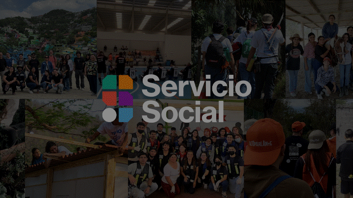

# Feria Servicio Social

<div align="center">
  <table>
    <tr>
      <td valign="middle" width="140">
        
      </td>
      <td valign="middle" align="left">
        <strong>Feria Servicio Social</strong>
        <br />
        <strong>Tecnológico de Monterrey Campus Ciudad de México</strong>
      </td>
    </tr>
  </table>
</div>

<p align="center">
  
</p>

Plataforma **full‑stack** que digitaliza la vinculación entre alumnos y empresas en la Feria de Servicio Social del Tecnológico de Monterrey. Reemplaza el proceso en papel con registro seguro,[...]

[](https://feriaserviciosocial.com)


## Funcionalidades clave
- **Alumno:** registro, perfil, QR dinámico y dashboard.
- **Empresa:** escaneo QR, lista de inscritos y bajas controladas.
- **Admin:** padrón de alumnos, eventos, empresas, proyectos y reportes.
- **Métricas:** dashboards con latencias y estadísticas de inscripción.

## Arquitectura (Abstracción)
```
Cliente (Browser)
    │ HTTPS
    ▼
Cloudflare (CDN + DDoS + DNS)
    │ HTTP (Flexible TLS)
    ▼
EC2:80/443 → Nginx (Reverse Proxy)
    │
    ├──▶ /api/*  → FastAPI app:8000 (Gunicorn + Uvicorn workers)
    │               │
    │               ├──▶ Redis (caché, rate limiting)
    │               └──▶ PostgreSQL (vía SSH Tunnel)
    │
    └──▶ /*      → React SPA (estáticos)
```

## Stack tecnológico
**Backend:** Python 3.12, FastAPI, SQLAlchemy async, asyncpg, Alembic, Pydantic v2, PyJWT, bcrypt, pyotp, cryptography/Fernet, SlowAPI, Redis, structlog, Sentry.

**Frontend:** React 19, Vite, React Router, Tailwind CSS, shadcn/ui, Recharts, html5‑qrcode, Framer Motion, TypeScript, Vitest.

**Infra/DevOps:** Docker, Docker Compose, Nginx, Cloudflare, AWS EC2, AWS SSM Parameter Store, GitHub Actions, GHCR, PostgreSQL.

## Seguridad (resumen)
- **MFA completo:** OAuth 2.0 + nonce anti‑replay + TOTP (RFC 6238).
- **QR cifrado:** payload con TOTP embebido + Fernet (AES‑128‑CBC + HMAC‑SHA256).
- **Rate limiting:** 10 req/min/IP en endpoints críticos.
- **Cookies seguras:** HttpOnly/Secure + refresh token con hash en DB.
- **CORS y headers de seguridad:** CSP, HSTS, X‑Frame‑Options, etc.

## Modelo de datos (entidades principales)
`Usuario`, `PadronAlumno`, `Evento`, `Empresa`, `Proyecto`, `Inscripcion`, `RefreshToken`, `GoogleNonce`, `LogAuditoria`, `RequestMetric`.

## API por dominios
| Dominio | Endpoints clave |
|---|---|
| Auth | `/api/v1/auth/login`, `/google/nonce`, `/google/callback`, `/totp/verify`, `/refresh`, `/logout` |
| Alumno | `/api/v1/alumno/dashboard`, `/qr-payload`, `/perfil` |
| Empresa | `/api/v1/empresa/escanear`, `/inscritos`, `/inscripcion/{id}` |
| Admin | CRUD de eventos/empresas/proyectos/padrón, `/logs` |
| Estadísticas | métricas por evento/empresa/carrera |
| Sistema | healthcheck, latencias, request count |

## Flujo de negocio
1. Admin precarga padrón oficial.
2. Alumno se registra y valida identidad.
3. Se habilita 2FA (TOTP).
4. Alumno selecciona eventos y completa perfil.
5. Se genera QR cifrado con refresco cada 30s.
6. Empresa escanea QR desde su dashboard.
7. Backend valida cupo/duplicados e inscribe.
8. Se envía confirmación y se registra auditoría.
9. Admin monitorea métricas y reportes.

## Gestión de secretos
- **Desarrollo:** `.env` local (ignorado en git).
- **Producción:** AWS SSM Parameter Store bajo `/feria/prod/*`.

## Docker e infraestructura
- **Multi‑stage build:** frontend compilado y servido por FastAPI.
- **Servicios prod:** `app` + `redis` + `nginx` en `docker-compose.prod.yml`.
- **Reverse proxy:** Nginx expone 80/443 y enruta `/api/*`.
- **Dominio:** administrado mediante `cloudflared` sobre Cloudflare.

## CI/CD y despliegue
Pipeline con GitHub Actions: **tests → build multi‑stage → push a GHCR → deploy vía SSH a EC2 → healthcheck → migraciones**.

## Desarrollo local
- Backend
    ```bash
    cd backend
    uv venv --python 3.12 .venv
    uv pip install -r requirements.txt
    alembic upgrade head
    uvicorn app.main:app --reload
    ```
- Frontend

    ```bash
    cd frontend
    npm ci
    npm run dev
    ```
    - Rutas protegidas por rol (alumno/empresa/admin).
    - Dashboard con Recharts y paneles especializados.
    - Escaneo QR con acceso a cámara (`html5‑qrcode`).

## Patrones de ingeniería
- Service layer y DI (`Depends`) en FastAPI.
- Logging estructurado con `request_id`.
- Background tasks para notificaciones.

## Observabilidad
Sentry + structlog JSON + métricas por endpoint con buffer en memoria. Dashboard técnico en el panel admin.

## Estructura del repositorio
```
backend/     # FastAPI + servicios + migraciones
frontend/    # React + Vite + UI
nginx/       # Reverse proxy y estáticos
scripts/     # Deploy y utilidades
```

## Contribuidores
<a href="https://github.com/Mariocgaitan/Proyecto-Criptografia-Servicio-Social/graphs/contributors">
  
</a>
